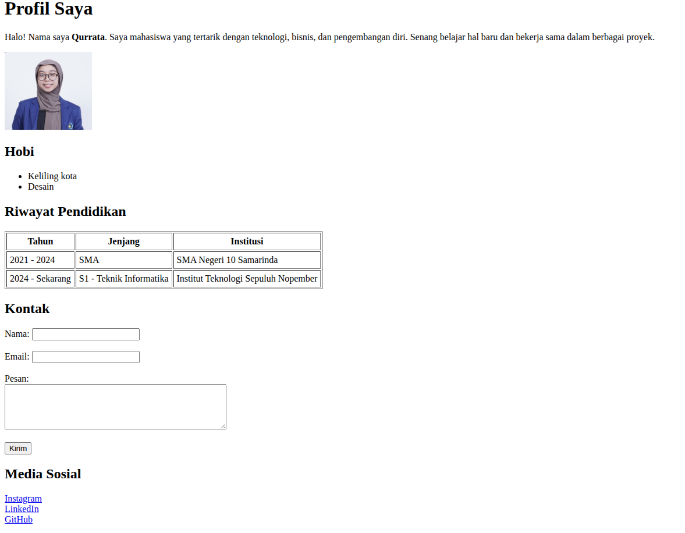

# Tugas Individu: Membuat Halaman Profil Sederhana

## Deskripsi
Tugas ini adalah latihan membuat halaman profil sederhana menggunakan **HTML dasar**.  
Halaman dibuat dengan nama **profil.html** di dalam folder `profil` (di `htdocs` untuk XAMPP atau `www` untuk Laragon).

## Instruksi
1. Salin kode HTML dasar yang menampilkan:
   - Judul profil (heading).
   - Paragraf deskripsi.
   - Foto diri (gambar).
   - Daftar hobi (list).
   - Tabel riwayat pendidikan.
   - Form kontak sederhana.
   - Link ke media sosial / GitHub.

## Laman HTML

## Source code
[source code](profil.html)
 