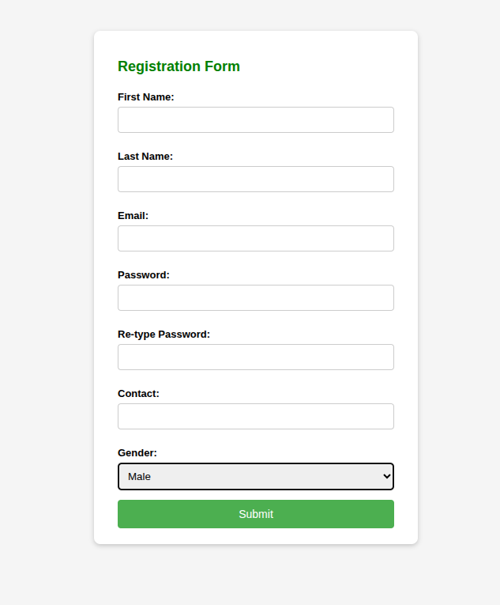
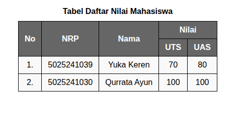
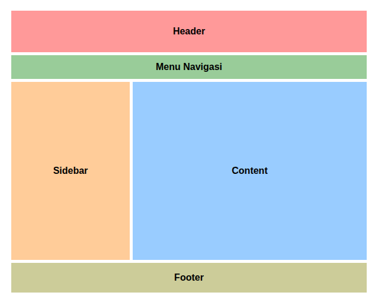

# Praktikum Pemrograman Web — Pertemuan 3

## Deskripsi
Folder ini berisi latihan pada pertemuan ke-3, yang berfokus pada pembuatan form, layout halaman, dan tabel menggunakan HTML dan CSS dasar. Setiap file HTML didampingi dengan screenshot hasil tampilannya.

## Daftar File
- [form.html](form.html) — Contoh form registrasi sederhana dengan styling CSS.
- [layout.html](layout.html) — Contoh layout halaman web dengan grid dan flexbox.
- [table.html](table.html) — Contoh tabel nilai mahasiswa dengan styling.

## Form

## Table

## Layout

---