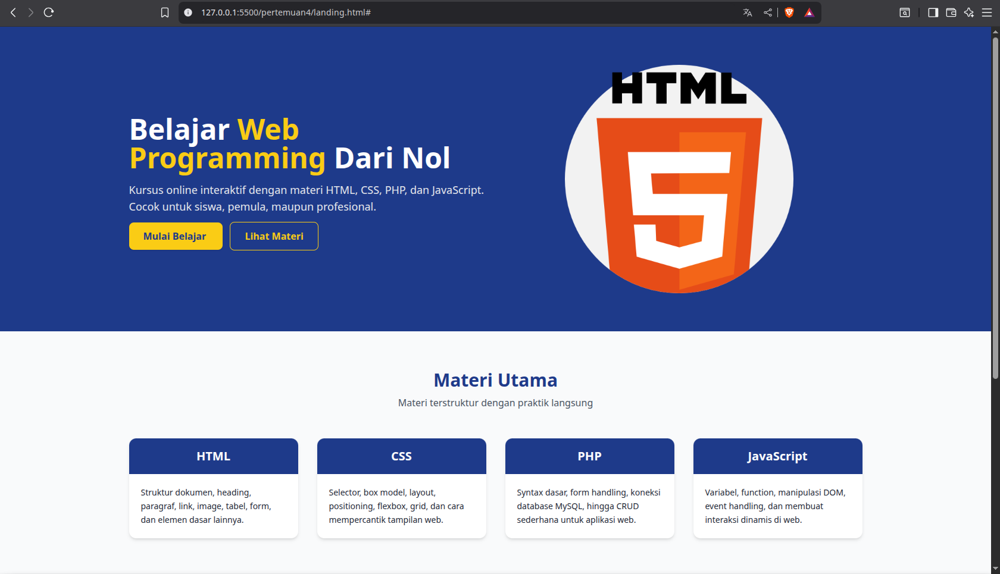

# Landing Page

Landing page modern untuk platform pembelajaran **Web Programming** (HTML, CSS, PHP, JavaScript).  
Dibangun menggunakan **Tailwind CSS** dengan desain minimalis, responsif, dan profesional (tone biru dongker).

---

## Fitur Landing Page
- **Hero Section**
  - Headline + tagline
  - CTA button "Mulai Belajar" & "Lihat Materi"
  - Gambar ilustrasi (coding icon)

- **Materi Utama**
  - 4 card interaktif: HTML, CSS, PHP, JavaScript
  - Hover effect & desain responsif

- **Keunggulan Course**
  - Video Tutorial 📹  
  - Latihan Interaktif 💻  
  - Sertifikat 🎓  

- **Footer**
  - Navigasi cepat (Home, Course, Login)
  - Warna konsisten biru dongker

---

## 🛠️ Teknologi yang Digunakan
- **HTML5** untuk struktur halaman
- **Tailwind CSS** untuk styling modern & responsif
- **CDN Tailwind** → tidak perlu setup build tool
- **Responsive Grid** untuk tampilan mobile, tablet, dan desktop
