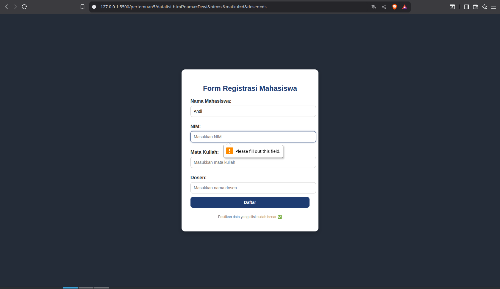
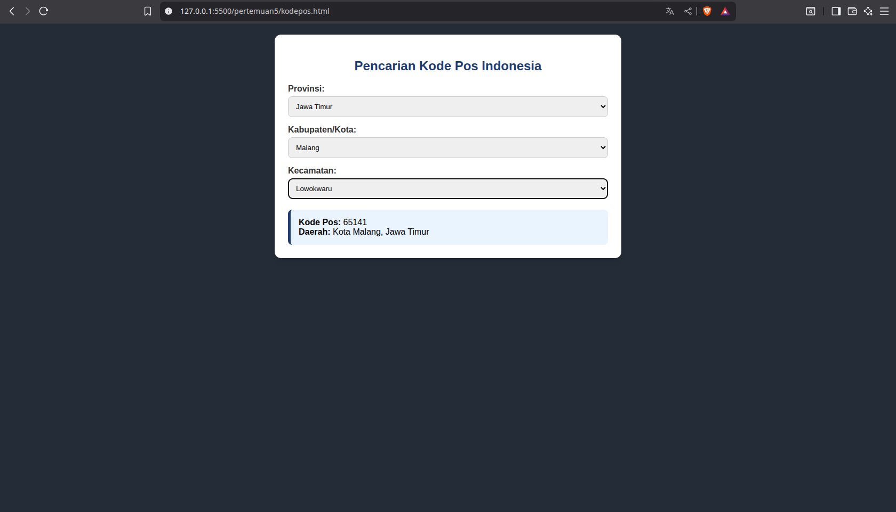
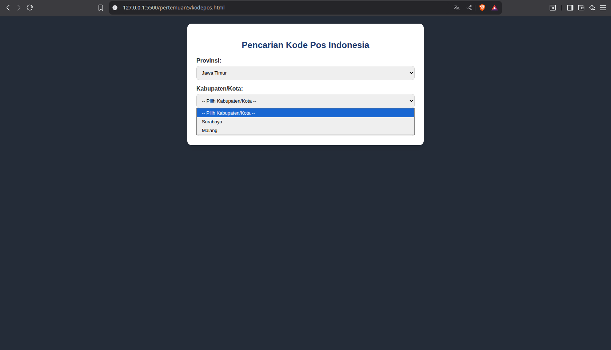

# Latihan Form & Dropdown

Repositori ini berisi latihan dasar **HTML + CSS + JavaScript** untuk membangun form interaktif dan pencarian data menggunakan dropdown dinamis.

---

## Daftar Latihan
### 1. Form Registrasi Mahasiswa

Membuat form registrasi dengan field:
- Nama Mahasiswa (dengan auto-suggest menggunakan `<datalist>`)
- NIM
- Mata Kuliah
- Dosen
- Tombol submit

🔹 **Fitur utama:** 
- Input dengan placeholder & validasi `required`.  

📂 File: [Src](datalist.html)

---

### 2. Pencarian Kode Pos Indonesia + Dropdown Dinamis

Form pencarian kode pos dengan 3 dropdown bertingkat:
1. **Provinsi**  
2. **Kabupaten/Kota**  
3. **Kecamatan**

Ketika user memilih sampai level Kecamatan → ditampilkan **Kode Pos + Info Daerah**.

🔹 **Fitur utama:**
- Dropdown **dinamis** (Kabupaten/Kecamatan berubah sesuai Provinsi).  
- Data dummy untuk Jawa Timur & DKI Jakarta.  
- Output ditampilkan dalam card informasi.  
- Menggabungkan konsep **Latihan 3 (Dropdown Dinamis)**.

📂 File: [Src](kodepos.html)

