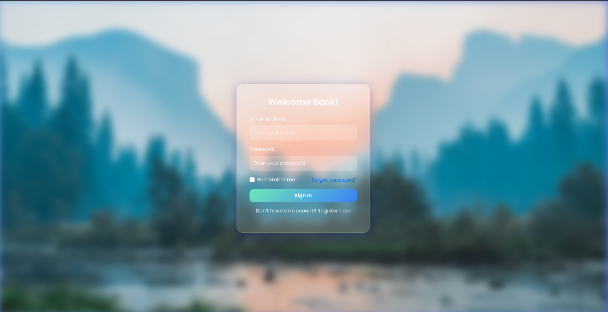

# 📚 Praktikum Pemrograman Web — Pertemuan 6

## 📖 Deskripsi
Folder ini berisi dua tugas praktikum pada pertemuan ke-6 yang berfokus pada penggunaan **Bootstrap Framework** untuk membuat layout responsif dan komponen UI yang menarik.

## 📋 Daftar Tugas

### 1. Halaman Konten Bootstrap Layout (`index.html`)
**Tujuan:** Membuat halaman konten dengan layout responsif menggunakan Bootstrap

**Fitur yang diimplementasikan:**
- **Header** dengan navigasi menggunakan Bootstrap buttons
- **Sidebar** dengan menu items menggunakan Bootstrap cards
- **Main Content Area** dengan grid layout responsif
- **Footer** dengan informasi perusahaan dan links
- **Bootstrap Grid System** (container, row, col)
- **Responsive Design** untuk berbagai ukuran layar

**Komponen Bootstrap yang digunakan:**
- Container & Grid System
- Cards
- Buttons
- Text utilities
- Background colors
- Spacing utilities

### 2. Halaman Login/Register (`login.html`)
**Tujuan:** Membuat halaman autentikasi dengan desain modern menggunakan Bootstrap dan custom CSS

**Fitur yang diimplementasikan:**
- **Glassmorphism Design** dengan efek blur dan transparansi
- **Sliding Animation** antara form login dan register
- **Responsive Form Layout** dengan Bootstrap form components
- **Custom Styling** dengan gradient background dan floating elements
- **Interactive Elements** dengan hover effects dan transitions
- **Modern UI/UX** dengan font Google Fonts (Poppins)

**Komponen Bootstrap yang digunakan:**
- Form controls dan labels
- Buttons dengan custom styling
- Grid system untuk layout
- Utility classes

**Teknologi Tambahan:**
- CSS3 Animations & Transitions
- Glassmorphism effects
- Custom JavaScript untuk form switching

## 🖼️ Preview UI


*Screenshot menampilkan kedua halaman yang telah dibuat dengan desain responsif dan modern*

## 🚀 Cara Menjalankan

1. **Buka file HTML di browser:**
   ```bash
   # Untuk halaman konten Bootstrap
   open index.html
   
   # Untuk halaman login/register
   open login.html
   ```

2. **Atau gunakan Live Server (recommended):**
   - Install Live Server extension di VS Code
   - Right-click pada file HTML → "Open with Live Server"

## 📁 Struktur File
```
pertemuan6/
├── index.html      # Halaman konten dengan Bootstrap layout
├── login.html      # Halaman login/register dengan glassmorphism
├── image.png       # Screenshot/preview UI
└── readme.md       # Dokumentasi (file ini)
```

## 🎨 Fitur Desain

### Index.html Features:
- ✅ Responsive Bootstrap grid layout
- ✅ Dark theme cards dengan white text
- ✅ Professional navigation structure
- ✅ Clean and organized content sections

### Login.html Features:
- ✅ Modern glassmorphism design
- ✅ Smooth sliding animations
- ✅ Interactive form elements
- ✅ Floating background elements
- ✅ Gradient color schemes
- ✅ Mobile-responsive design

## 📚 Pembelajaran

Praktikum ini mengajarkan:
1. **Bootstrap Framework** - Penggunaan grid system, components, dan utilities
2. **Responsive Web Design** - Layout yang beradaptasi dengan berbagai ukuran layar
3. **Modern CSS Techniques** - Glassmorphism, animations, dan custom styling
4. **Form Handling** - Membuat form yang user-friendly dan interaktif
5. **UI/UX Principles** - Desain yang menarik dan mudah digunakan

---

> **Note:** Kedua halaman menggunakan Bootstrap 5.3.3 CDN dan telah dioptimalkan untuk berbagai perangkat dan browser modern.
