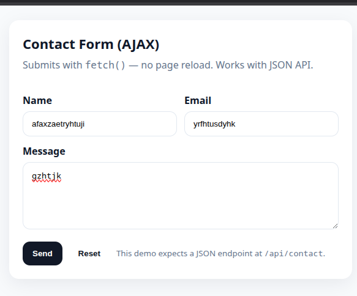

# AJAX Contact Form (Tanpa Reload)



## Ringkasan

- Halaman utama: `index.html` berisi form kontak dengan field `name`, `email`, dan `message`.
- Endpoint API yang diharapkan: `POST /api/contact` (mengembalikan JSON).
- Server contoh: `server.js` (Express) menerima JSON dan merespons dengan pesan sukses.

## Bagaimana form disimpan (apa yang terjadi)

1. Pengguna mengisi form di `index.html` dan menekan tombol "Send".
2. JavaScript pada halaman menangani event `submit`, mencegah reload halaman, dan mengumpulkan field menggunakan `new FormData(form)`.
3. Data diubah menjadi objek lalu di-serialize ke JSON: `JSON.stringify(data)`.
4. Kode memanggil `fetch('/api/contact', { method: 'POST', headers: { 'Content-Type': 'application/json' }, body: JSON.stringify(data) })`.
5. Server (`server.js`) menerima JSON, memvalidasi field yang dibutuhkan (`name`, `email`, `message`) dan mengembalikan respons JSON berisi `message`.
6. Jika sukses, frontend menampilkan pesan sukses dan mereset form; jika gagal, menampilkan pesan error.

## Payload yang dikirim

JSON body berisi objek dengan properti:

- `name` (string) — nama pengirim
- `email` (string) — alamat email pengirim
- `message` (string) — isi pesan

Contoh payload:

{
	"name": "Budi",
	"email": "budi@example.com",
	"message": "Halo! Ini demo AJAX."
}

## Contoh respons sukses

{
	"message": "Thanks Budi! We'll reply to budi@example.com."
}

## Cara menjalankan (lokal)

Prasyarat: Node.js dan npm terinstal.

1. Pasang dependensi:

```bash
npm install
```

2. Jalankan server:

```bash
npm start
```

Server akan berjalan di `http://localhost:3000` (lihat `server.js`). Buka `index.html` di browser (mis. buka file langsung atau layani lewat server statis). Untuk pengalaman paling mirip produksi, akses `http://localhost:3000` jika kamu men-serve `index.html` dari sana.

## Cara menguji API dengan curl

Contoh request menggunakan curl (mengirim JSON):

```bash
curl -X POST http://localhost:3000/api/contact \
	-H "Content-Type: application/json" \
	-d '{"name":"Budi","email":"budi@example.com","message":"Halo"}'
```

Jika field ada yang kosong, server contoh mengembalikan 400 dan JSON error:

```json
{ "error": "All fields are required." }
```

## Penjelasan untuk developer

- Frontend (`index.html`) menggunakan:
	- FormData untuk membaca nilai form
	- Object.fromEntries(...) untuk membuat objek plain
	- fetch dengan headers `Content-Type: application/json` dan `Accept: application/json`
	- men-set `credentials: 'same-origin'` untuk menyertakan cookie jika diperlukan

- Backend (`server.js`) adalah contoh Express sederhana yang:
	- Mem-parse body JSON (`express.json()`)
	- Mengembalikan status 400 jika ada field yang hilang
	- Mengembalikan JSON sukses jika valid

## Tips dan kemungkinan pengembangan

- Menambahkan validasi sisi server yang lebih ketat (email format, panjang pesan).
- Menyimpan pesan ke database (mis. SQLite, PostgreSQL, MongoDB) alih-alih hanya console.log.
- Menambahkan proteksi CSRF untuk aplikasi yang men-serve halaman dan API di domain yang sama.
- Menambahkan notifikasi UI yang lebih kaya dan handling error yang spesifik.

---

Jika kamu mau, saya bisa: menambahkan endpoint untuk menyimpan ke file/DB, men-serve `index.html` dari Express agar demo bisa diakses langsung di http://localhost:3000, atau menambahkan skrip test otomatis untuk endpoint. Pilih saja yang ingin diimplementasikan berikutnya.